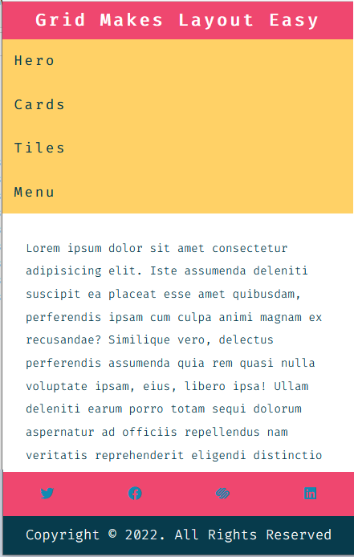
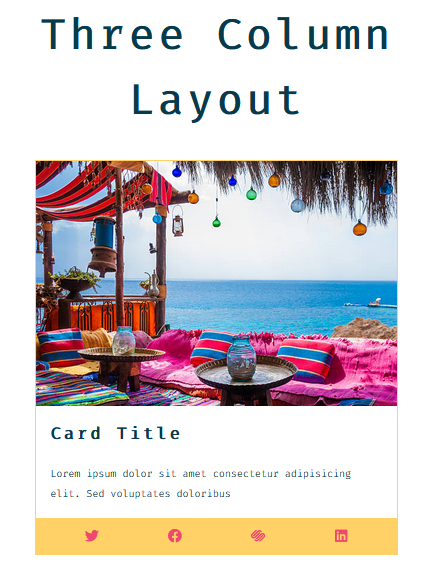

# css-grid-layout
Simple web application for css grid layout
- Responsive Design. 
- css grid for Columns Layouts. 
- Navbar.
- Animation. 
- External Icons from fontawesome.  

To run Demo : https://css-mini-grid-layout.netlify.app

## Screenshots 🎉

<table >
 <tr>
  <td></td>
  <td></td>
  <td></td>
 </tr>
 <tr>
  
 </tr>
</table>